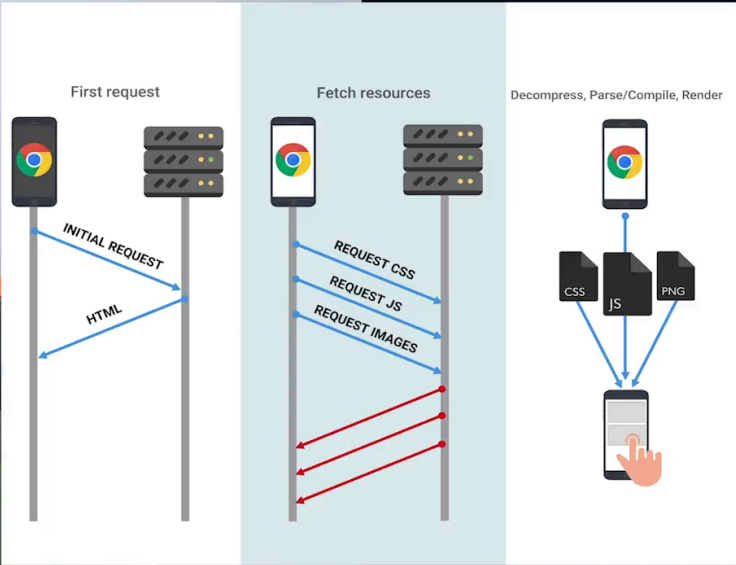
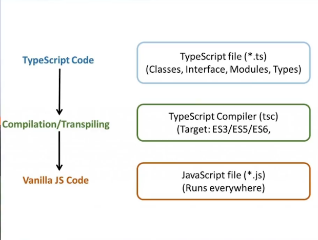
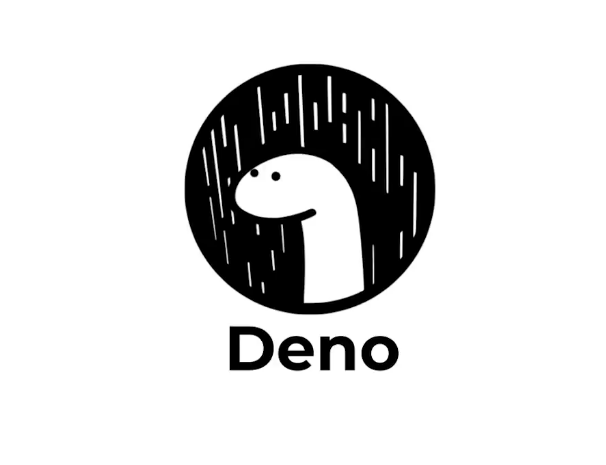
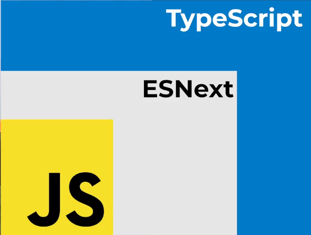

# Typescript Fundamentals


## Introduction
### 1. Environment

* [.gitignore file](.gitignore) from [gitignore.io](https://www.toptal.com/developers/gitignore/).
* [.editorconfig file](.editorconfig) to define format from [editorconfig.org](https://editorconfig.org/).
* Install dependences ```npm init -y```.
* Install Typescript as dev dependence in the project ```npm install typescript --save-dev```.
* ```npx tsc --version``` to verify version.


💡 In a file .js write ```//@ts-check``` to check syntax.

### 2. El compilador

Transpila TS y genera Js





* Luego de escribir en .ts -> ```npx tsc src/01-hello.ts``` -> Esto lo transcribe a .js

* ```npx tsc src/01-hello.ts --target es6``` Para decirle al compilador que transpile en ECMAScript 6


* ```npx tsc src/*.ts --target es6 --outDir dist``` Para decirle al compilador que transpile en ECMAScript 6 y que guarde todos los archivos .ts en la carpeta [dist](dist)

**🦖 Dato para estar pendiente!**

[**Deno**](https://deno.land/) es un runtime basado en la v8 de Chrome, desarrollado en el lenguaje de programación Rust y que compite directamente con Node.js, tanto en funcionalidades como en casos de uso.



### 3. TSConfig.json

Para configurar como el compilador de Ts.

el comando ```npx tsc --init``` inicializa un archivo [tsconfig.ts](tsconfig.json). En este va estar la configuración como el target, ourDir, strictMode, etc.

Ahora solo hay que correr ```npx tsc```.

💡 Se puede programar la compilación continua corriendo el comando ```npx tsc --watch```

## Primitive data type

💡 TypeScript es un superset, es decir, es todo lo que ya está en JavaScript y todo el sistema de tipos.



| Js | Ts |
| ------ | ------ |
| const age = 20; | const age: number = 20; |
